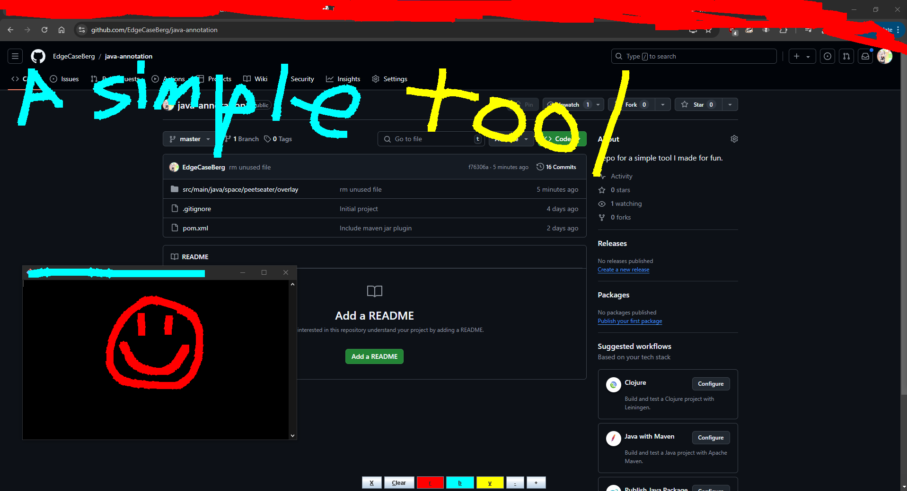

## Java Annotation Tool

A simple tool to run when you want to draw a few lines or circles
on your screen. Handy for if you're explaining something via screen
share or streaming and want to quick mark up the screen to explain a
point or so. 

### Usage

Use maven to package the jar up, then run the jar via 

    java -jar target/Overlay-1.0-SNAPSHOT.jar

and it will run instantly, taking up the width of the screen you 
ran the command from. It uses Java 17.

### Fun notes

The creation of this little tool was streamed live to twitch. You can
find a reference to it on my Youtube. The code on stream isn't exactly
what's in this repository, because like all things, one iterates on a 
tool as needed. So this version has some additional key bindings to make
things easier.

### Limitations

At the moment there's no handling of scaling. So if you're using settings
that make the screen scale to a resolution that doesn't match the actual
size of the screen then it might not be quite right. I might fix this in
the future, but for now I haven't needed to. 